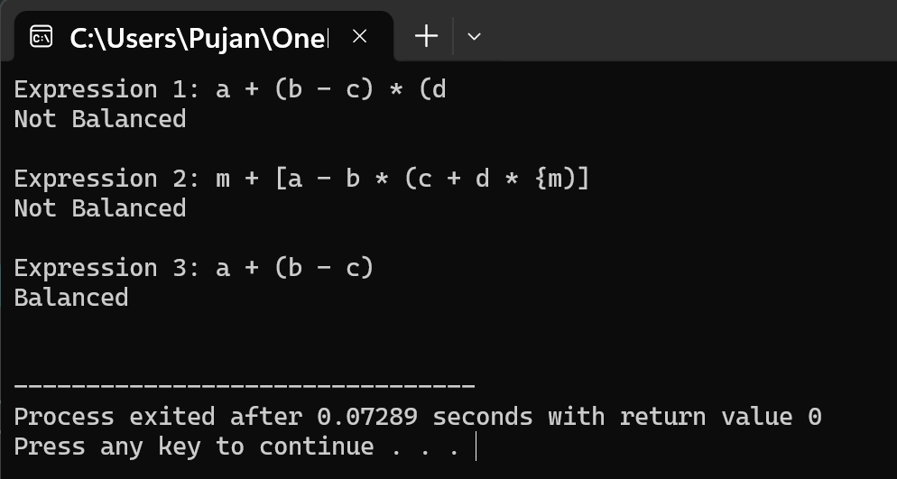

# Question 2: Infix to Postfix Conversion and Evaluation

## Problem Statement

Write a program to convert an infix mathematical expression to postfix and evaluate it.

---

## Data Structures

The program uses two main data structures to convert and evaluate expressions:

### Stack for Conversion
- **`char s[100]`**: A character array that acts as a stack to hold operators and parentheses during the conversion process. It stores up to 100 characters.
- **`int t`**: The top pointer for the stack, initialized to -1 to indicate an empty stack.

### Stack for Evaluation
- **`int arr[100]`**: An integer array used as a stack during postfix evaluation. It stores the operands and intermediate results.
- **`int p`**: The top pointer for the evaluation stack, also starting at -1.

## Functions Implemented

### 1. `void add(char x)`
This function pushes an operator or parenthesis onto the stack. It increments the top pointer and stores the character at that position. This is used during the conversion from infix to postfix.

### 2. `char rem()`
This function pops and returns the top element from the stack. It returns the character at the current top position and then decrements the top pointer.

### 3. `int prior(char x)`
This function determines the precedence of operators. Multiplication and division have higher precedence (returns 2) than addition and subtraction (returns 1). This is important for maintaining the correct order of operations during conversion.

### 4. `void convert(char* in, char* out)`
This is the main conversion function that transforms infix notation to postfix notation. It reads each character from the infix expression and processes it according to these rules:
- If it's a number or letter, it goes directly to the output
- If it's an opening parenthesis, it's pushed to the stack
- If it's a closing parenthesis, operators are popped until the matching opening parenthesis is found
- If it's an operator, operators with higher or equal precedence are popped first, then the new operator is pushed

### 5. `int calc(char* post)`
This function evaluates the postfix expression and returns the result. It uses a stack to store numbers. When it finds an operator, it pops two numbers, performs the operation, and pushes the result back. The final answer is the last number remaining in the stack.

## Main Method Organization

The main function handles user input and displays the results:

1. First, it declares two character arrays to store the infix expression and the resulting postfix expression.
2. It prompts the user to enter an infix expression.
3. The `convert()` function is called to transform the infix expression into postfix notation.
4. The postfix expression is displayed to the user.
5. The `calc()` function evaluates the postfix expression and prints the final numerical result.
6. The program ends by returning 0.

## Input/Output

