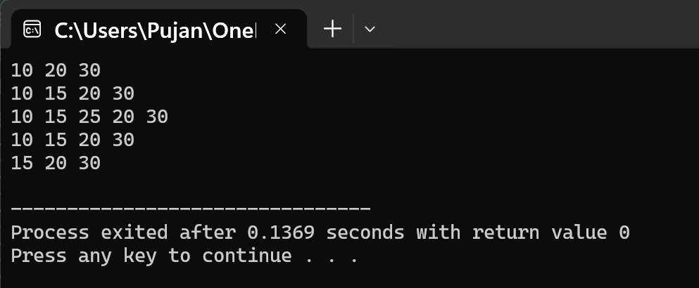

# Question 4: Doubly Linked List Implementation

## Problem Statement

How can we implement the doubly linked list using structure? Write a method to insert(after given node) and delete the node in doubly linked list. Write main() to demonstrate the use of the functions.

---

## Data Structures

The program uses a doubly linked list where each node can be traversed in both forward and backward directions:

### Node Structure
- **`struct node`**: This structure represents each element in the doubly linked list. It contains three parts:
  - **`int data`**: Stores the integer value for the node.
  - **`struct node* next`**: A pointer that points to the next node in the list.
  - **`struct node* prev`**: A pointer that points to the previous node in the list.

### List Pointer
- **`struct node* head`**: A global pointer that points to the first node of the list. It is initialized to NULL to indicate an empty list.

## Functions Implemented

### 1. `void display()`
This function prints all the elements in the doubly linked list from the beginning to the end. It traverses through each node using the next pointer and prints the data. If the list is empty, it displays "empty".

### 2. `void insert(int val)`
This function adds a new node at the end of the doubly linked list. It creates a new node and sets its data to the given value. If the list is empty, the new node becomes the head. Otherwise, it traverses to the last node and links the new node there, updating both next and prev pointers.

### 3. `void insertAfter(struct node* ptr, int val)`
This function inserts a new node after a specified node in the list. It takes a pointer to an existing node and a value as parameters. The new node is created and inserted right after the given node, updating the next and prev pointers of surrounding nodes to maintain the doubly linked structure.

### 4. `void deleteNode(int val)`
This function removes a node with a specific value from the list. It searches for the node containing the given value. Once found, it updates the next and prev pointers of neighboring nodes to bypass the node being deleted. Special cases are handled for deleting the head node and the last node. The memory of the deleted node is freed.

## Main Method Organization

The main function demonstrates the use of insert and delete operations on a doubly linked list:

1. Three nodes with values 10, 20, and 30 are added to the list using `insert()`, and the list is displayed.
2. A new node with value 15 is inserted after the head node using `insertAfter()`, and the updated list is shown.
3. Another node with value 25 is inserted after the second node, and the list is displayed again.
4. The node with value 25 is deleted using `deleteNode()`, and the resulting list is printed.
5. The head node (value 10) is deleted to demonstrate deletion at the beginning, and the final list is displayed.
6. The program ends by returning 0.

## Input/Output

