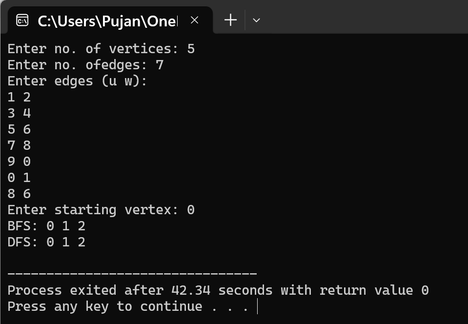

# Question 5: Undirected Graph Traversal using BFS and DFS

## Problem Statement

How can we implement the undirected graph using adjacency matrix? Write a function that implement the BFS and DFS technique to traverse through the graph. Demonstrate the use of your program with example graph.

---

## Data Structures

The program uses an adjacency matrix to represent an undirected graph:

### Graph Representation
- **`int g[SIZE][SIZE]`**: A 2D array that represents the adjacency matrix of the graph. If `g[i][j]` is 1, there is an edge between vertex `i` and vertex `j`. If it's 0, there is no edge.
- **`int v[SIZE]`**: An array to keep track of visited vertices during traversal. A value of 1 means the vertex has been visited, and 0 means it hasn't.
- **`int n`**: Stores the total number of vertices in the graph.

### Queue for BFS
- **`int q[SIZE]`**: An array used as a queue in the BFS function to store vertices that need to be visited.
- **`int f` and `int r`**: Variables that act as front and rear pointers for the queue.

## Functions Implemented

### 1. `void bfs(int s)`
This function performs Breadth-First Search traversal starting from vertex `s`. It uses a queue to visit vertices level by level. First, it marks all vertices as unvisited and then adds the starting vertex to the queue. It keeps removing vertices from the front of the queue, prints them, and adds all their unvisited neighbors to the rear of the queue. This continues until the queue is empty.

### 2. `void dfs(int x)`
This function performs Depth-First Search traversal starting from vertex `x`. It uses recursion to explore as far as possible along each branch before backtracking. The function prints the current vertex, marks it as visited, and then recursively calls itself for all unvisited neighbors.

## Main Method Organization

The main function handles graph creation and demonstrates both traversal techniques:

1. The user is asked to enter the number of vertices in the graph.
2. The user enters the number of edges that will connect the vertices.
3. The adjacency matrix is initialized with all zeros, meaning no edges exist initially.
4. The user inputs each edge as a pair of vertices. For each edge, both `g[u][w]` and `g[w][u]` are set to 1 because the graph is undirected.
5. The user specifies which vertex to start the traversal from.
6. The BFS function is called to perform breadth-first traversal and display the result.
7. All vertices are marked as unvisited again by resetting the visited array.
8. The DFS function is called to perform depth-first traversal and display the result.
9. The program ends by returning 0.

## Input/Output

