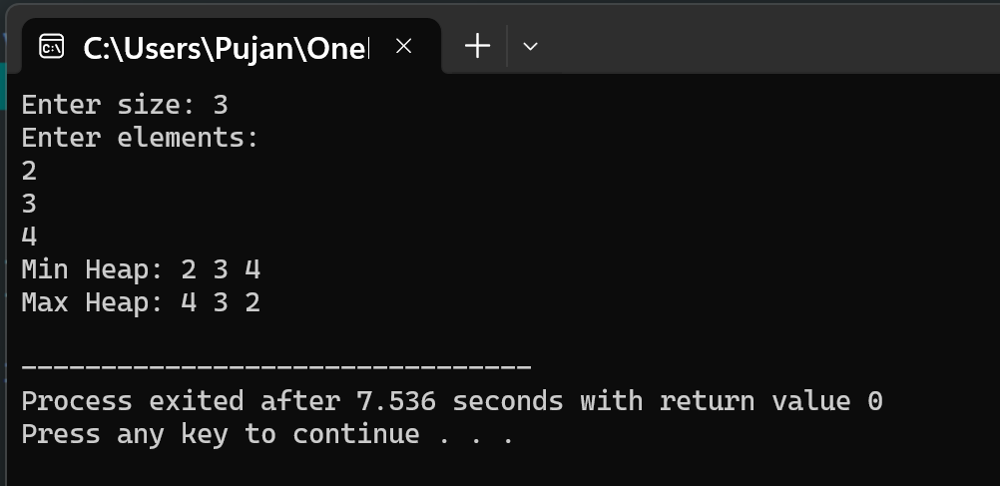

# Question 6: Building Min and Max Heap

## Problem Statement

Given the array of the data (unsorted), write a program to build the min and max heap.

---

## Data Structures

The program uses arrays to represent heap data structures:

### Arrays
- **`int arr[size]`**: This array stores the original unsorted elements entered by the user.
- **`int minHeap[size]`**: A copy of the original array that will be converted into a min heap, where the smallest element is at the root.
- **`int maxHeap[size]`**: A copy of the original array that will be converted into a max heap, where the largest element is at the root.

### Heap Properties
In both heaps, the elements are stored in an array but follow a tree structure. For any element at index `i`:
- Left child is at index `2*i + 1`
- Right child is at index `2*i + 2`
- Parent is at index `(i-1)/2`

## Functions Implemented

### 1. `void swp(int *a, int *b)`
This function swaps two integer values. It takes pointers to two integers and exchanges their values using a temporary variable. This is used during the heapify process.

### 2. `void minH(int arr[], int size, int index)`
This function maintains the min heap property for a subtree. It compares a node with its left and right children to find the smallest value. If the smallest is not the current node, it swaps them and recursively calls itself to ensure the heap property is maintained throughout the subtree.

### 3. `void maxH(int arr[], int size, int index)`
This function maintains the max heap property for a subtree. It compares a node with its children to find the largest value. If the largest is not the current node, it swaps them and recursively applies the same process to maintain the heap property.

### 4. `void buildMin(int arr[], int size)`
This function builds a complete min heap from an unsorted array. It starts from the last non-leaf node and calls `minH()` for each node going backwards to the root. This ensures the entire array follows the min heap property.

### 5. `void buildMax(int arr[], int size)`
This function builds a complete max heap from an unsorted array. Similar to `buildMin()`, it processes nodes from the last non-leaf node to the root, calling `maxH()` to arrange elements according to the max heap property.

### 6. `void show(int arr[], int size)`
This function displays all elements in an array. It loops through the array and prints each element separated by a space, then adds a newline at the end.

## Main Method Organization

The main function handles input and demonstrates heap construction:

1. The user is prompted to enter the number of elements they want in the array.
2. Three arrays are declared: one for the original data and two copies for building the heaps.
3. The user enters the elements one by one, and each value is stored in all three arrays.
4. The `buildMin()` function is called to convert the minHeap array into a valid min heap structure.
5. The `buildMax()` function is called to convert the maxHeap array into a valid max heap structure.
6. Both heaps are displayed using the `show()` function to demonstrate the final heap arrangements.
7. The program ends by returning 0.

## Input/Output

