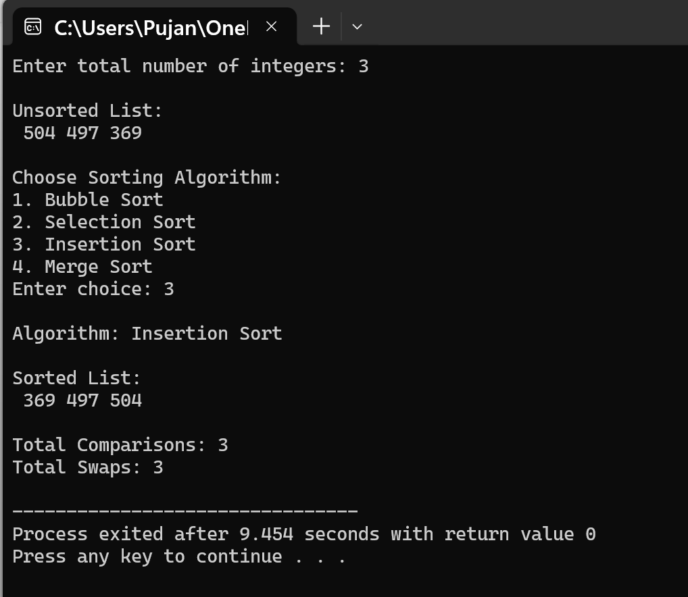

8. Write a program that generates a list of N random integers in the range [1, 1000], where N is provided by the user at run time. Then, perform the following tasks:
(a) Ask the user to choose a sorting algorithm from the following:
• Bubble Sort
• Selection Sort
• Insertion Sort
• Merge Sort
(b) Sort the randomly generated numbers using the chosen algorithm.
(c) Print the numbers before and after sorting.
(d) Display the total number of comparisons and swaps (if applicable)performed by the chosen algorithm.

ANSWER:

The program uses arrays and variables to store data and track algorithm performance:
Arrays

int a[n]: The main array that stores the randomly generated integers. The size is determined by user input at runtime.
int L[n1] and int R[n2]: Temporary arrays used in the merge sort algorithm to hold the left and right halves of the array being merged.

Performance Tracking Variables

int comp: A global counter that tracks the total number of comparisons made during sorting.
int swap: A global counter that tracks the total number of swaps performed during sorting.

Other Variables

int n: Stores the number of elements the user wants to generate.
int ch: Stores the user's choice of sorting algorithm.

Functions Implemented
1. void merge(int a[], int l, int m, int r)
This is a helper function for merge sort that merges two sorted subarrays into one sorted array. It takes the array and three indices (left, middle, right) as parameters. The function creates two temporary arrays for the left and right portions, then compares elements from both and places them back in the original array in sorted order. Each comparison is counted.
2. void mergeSort(int a[], int l, int r)
This function implements the merge sort algorithm using recursion. It divides the array into two halves, recursively sorts each half, and then merges them back together using the merge() function. This process continues until the array is completely sorted.
Main Method Organization
The main function handles user interaction and implements multiple sorting algorithms:

1. The user is asked to enter how many random numbers they want to generate.
2. An array of that size is created, and random numbers between 1 and 1000 are generated using rand().
3. The unsorted list is displayed to the user.
4. A menu is shown with four sorting options: Bubble Sort, Selection Sort, Insertion Sort, and Merge Sort.
5. Based on the user's choice, the corresponding sorting algorithm is executed:

- Bubble Sort: Repeatedly compares adjacent elements and swaps them if they're in the wrong order.
- Selection Sort: Finds the minimum element in the unsorted portion and places it at the beginning.
- Insertion Sort: Builds the sorted array one element at a time by inserting each element in its correct position.
- Merge Sort: Divides the array into halves, sorts them recursively, and merges them back.

6. During sorting, comparisons and swaps are counted (except swaps for merge sort, which doesn't use traditional swaps).
7. After sorting, the sorted list is displayed along with the total number of comparisons and swaps performed.
8. The program ends by returning 0.
**Input/Output**

